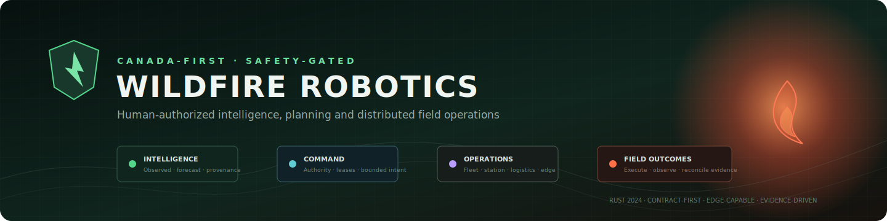
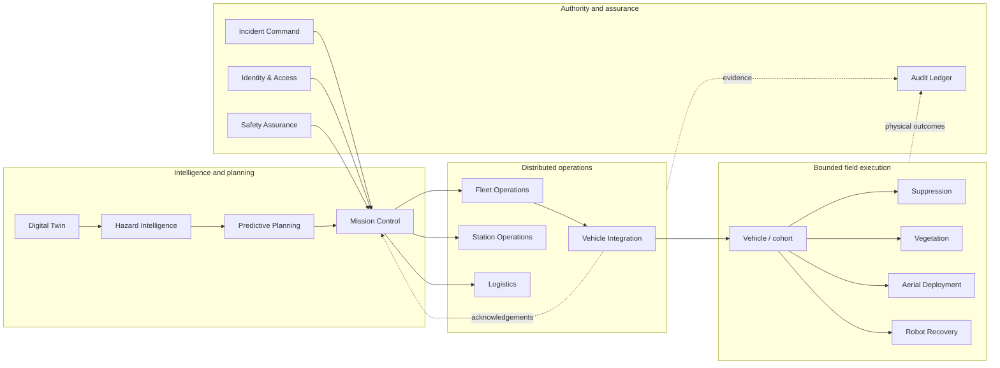

<p align="center">
  
</p>

<p align="center">
  
  
  
  
  
</p>

<p align="center">
  <strong>Human-authorized incident operations across intelligence, planning, robots, stations, logistics, suppression, safety, and recovery.</strong>
</p>

> [!IMPORTANT]
> This repository contains software models, deterministic simulations, operator demonstrations,
> contracts, and deployment evidence tooling. It does not itself authorize field operations or
> establish that any aircraft, robot, model, payload, or suppression technique is safe for physical
> use. Applicable law, regulators, airspace authority, Incident Command, approved safety cases, and
> local emergency-stop behavior remain authoritative.

## Overview

Wildfire Robotics is a Canada-first platform for coordinating wildfire intelligence and
heterogeneous robotic operations at continental scale. The system is organized as explicit bounded
contexts, uses human authorization for consequential actions, and treats uncertainty, provenance,
physical outcome, and degraded operation as first-class domain concerns.

The authoritative backend is a Rust 2024 Cargo workspace. Rust owns domain logic, services,
edge reconciliation, messaging, authorization, safety controls, evidence, simulation, and platform
tooling. TypeScript is used for the browser-based operator console and generated contract clients,
consistent with [ADR-016](docs/adr/ADR-016-rust-first-implementation-language.md).

The project currently includes:

- A 28-crate Rust workspace covering operational domains and platform capabilities.
- A task-oriented operator console with 15 specialized workspaces.
- OpenAPI, Protocol Buffers, OGC, schema, fixture, and generated-client contracts.
- Deterministic scenario, property, contract, architecture, migration, recovery, and scale checks.
- GitOps-oriented Kubernetes and OCI deployment contracts.
- Attributable quality evidence, coverage, SBOM, provenance, and release-gate tooling.
- Architecture decisions and production-readiness requirements for safety-sensitive operations.

## Operating principles

| Principle | Project interpretation |
|---|---|
| Human command authority | Automation advises or executes bounded intent; it does not supersede Incident Command. |
| Safety before availability | Unsafe, stale, ambiguous, expired, or unverifiable authority fails closed. |
| Edge-first continuity | Vehicles and stations retain bounded local safety and mission state through upstream loss. |
| Explicit uncertainty | Estimates expose freshness, provenance, uncertainty, limitations, and validity horizons. |
| Commands are not outcomes | Acceptance, execution, physical effect, and evidence reconciliation are separate states. |
| Partitioned scale | Cells, cohorts, sectors, stations, and regions avoid fleet-wide synchronous coordination. |
| Contract ownership | Bounded contexts own their models and integrate through versioned published contracts. |
| Evidence-based promotion | Code review alone does not promote safety-critical cyber-physical capability. |
| Canada-first governance | Protected Canadian operational data is constrained to approved Canadian regions. |

The formal authority order and architecture baseline are defined in
[docs/architecture](docs/architecture/README.md).

## Product surfaces

### Operator console

The Vite-based console in [`packages/operator-web`](packages/operator-web) provides specialized
workspaces for:

| Group | Workspaces |
|---|---|
| Command | Incident Command, Hazard Intelligence, Predictive Planning, Mission Control |
| Operations | Fleet, Vehicle Integration, Station Operations, Logistics, Vegetation Management |
| Actuation | Suppression Operations, Aerial Deployment |
| Assurance | Safety Assurance, Identity & Access, Robot Care & Recovery |
| Business | Commercial Operations |

The development console intentionally uses a deterministic demo snapshot. Its live map overlays may
retrieve public CWFIS, NASA EONET, NASA GIBS, and OpenStreetMap data through development-only Vite
proxies. Labels such as “live,” fleet quantities, aircraft motion, robot placement, water delivery,
and deployment progress in demo mode are visualization scenarios—not operational telemetry.

### Domain and platform services

The Rust workspace aligns implementation units with bounded contexts:

| Capability | Primary crates |
|---|---|
| Command and planning | `incident-command`, `mission-control`, `predictive-planning` |
| Intelligence and digital representation | `hazard-intelligence`, `digital-twin` |
| Physical operations | `fleet-operations`, `vehicle-integration`, `station-operations`, `logistics` |
| Field actuation | `suppression-operations`, `aerial-deployment-operations`, `vegetation-management` |
| Assurance and authority | `safety-assurance`, `identity-access`, `audit-ledger` |
| Recovery and continuity | `robot-care-recovery`, `infrastructure-recovery`, `edge-reconciliation` |
| Platform integration | `api-gateway`, `messaging-core`, `messaging-nats`, `persistence-postgres` |
| Shared contracts | `shared-kernel`, `contracts-generated`, `object-manifest`, `operations-core` |
| Qualification and economics | `scale-qualification`, `commercial-operations` |

See the [DDD context map](docs/ddd/context-map.md), [integration contract
registry](docs/ddd/integration-contracts.md), and [ubiquitous
language](docs/ddd/ubiquitous-language.md) before changing ownership boundaries.

## Architecture



### Hierarchical control

The platform follows the hierarchy described by
[ADR-053](docs/adr/ADR-053-million-asset-hierarchical-fleet-architecture.md):

```text
global control plane
└── region
    └── station / incident sector
        └── local cohort
            └── vehicle
```

Authority, membership, telemetry, planning, and failure containment are partitioned by tenant,
region, incident, sector, geography, capability, and time. Safety, motion, actuation envelopes,
current mission state, and emergency stop remain local. A cloud or station partition must not turn
expired authority into valid authority.

### Command lifecycle

Consequential operations distinguish:

```text
proposed → authorized → dispatched → transport acknowledged
         → vehicle accepted → executing → physical outcome observed
         → evidence reconciled
```

At-least-once delivery is never presented as exactly-once physical effect. Commands carry bounded
scope, expiry, version fences, idempotency keys, and identity context; local controllers enforce
their own safety invariants.

## Repository structure

```text
.
├── crates/                 Rust bounded contexts and platform crates
├── src/                    Context-aligned source and architecture boundary inputs
├── packages/
│   ├── operator-web/       Browser operator console
│   ├── api-client/         Generated/validated TypeScript API client
│   └── contracts-client/   Contract conformance client
├── contracts/              OpenAPI, Proto, OGC, fixtures, schemas, baselines
├── docs/
│   ├── adr/                Architecture decision records
│   ├── architecture/       Governed architecture baseline
│   ├── ddd/                Context map, language, process and integration rules
│   ├── implementation/     Delivery and traceability plans
│   ├── operations/         Readiness, capacity and risk records
│   ├── runbooks/           Security, access, backup and vulnerability procedures
│   └── testing/            Deterministic testing and evidence conventions
├── deploy/                 OCI, Kubernetes, GitOps, policy and recovery validation
├── tools/                  Quality, contract, architecture, migration and release gates
├── tests/                  Cross-cutting fixtures and integration tests
└── target/evidence/        Generated local evidence; never committed
```

## Getting started

### Prerequisites

The CI baseline is the supported reproducible reference:

- Rust `1.97.1`, edition 2024
- `rustfmt`, Clippy, and `llvm-tools-preview`
- Node.js `24.4.1` and npm
- `cargo-nextest 0.9.140`
- `cargo-deny 0.20.2`
- `cargo-audit 0.22.2`
- `cargo-llvm-cov 0.8.7`
- `cargo-cyclonedx 0.5.9`
- Semgrep `1.170.0`
- Gitleaks `8.28.0`
- `kubectl 1.33.3` for deployment validation

The Rust toolchain is pinned by [`rust-toolchain.toml`](rust-toolchain.toml). Quality-tool versions
are governed by [`tools/quality-tools.toml`](tools/quality-tools.toml).

### Install dependencies

```bash
rustup show
cargo fetch --locked
npm ci
npm --prefix packages/operator-web ci
npm --prefix packages/api-client ci
npm --prefix packages/contracts-client ci
```

Use lockfiles. Do not update dependencies incidentally in an unrelated change.

### Run the operator console

```bash
npm run dev
```

Open <http://localhost:5173>. The root script starts the operator console in deterministic demo
mode on `0.0.0.0:5173`.

Useful console commands:

```bash
npm --prefix packages/operator-web run lint
npm --prefix packages/operator-web test
npm --prefix packages/operator-web run build
npm --prefix packages/operator-web run budget
```

### Run the Rust workspace

For targeted development:

```bash
cargo check --workspace --locked
cargo test --workspace --locked
cargo clippy --workspace --all-targets --all-features --locked
```

For an attributable repository-wide gate:

```bash
cargo quality
```

`cargo quality` is the authoritative developer verification command. It validates the Rust
workspace, generated clients, browser console, contracts, deployment manifests, recovery evidence,
architecture boundaries, dependency policy, security scans, coverage, and evidence generation.

## Verification and evidence

Randomized tests and simulations require an explicit unsigned 64-bit seed. The canonical CI seed is
`0x5749_4c44_4649_5245`. Failures must report the seed and smallest reproducible input. Unit tests
must not implicitly read wall-clock time, entropy, network services, credentials, or hardware.

The quality gate writes attributable artifacts under `target/evidence`, including:

- Command logs and results
- Rust and npm CycloneDX SBOMs
- Coverage output
- Contract and architecture validation
- Deployment and recovery validation
- A non-promotional `quality-manifest.json`

Local evidence manifests contain digests but are unsigned. On `main`, the least-privilege
`release-evidence` workflow regenerates a deterministic bundle from a clean checkout and uses GitHub
OIDC with Sigstore/Cosign to sign and immediately verify it. Evidence generation does not publish a
release, grant field authority, or prove physical-system endurance.

Read [deterministic test conventions](docs/testing/README.md) and
[release-candidate requirements](docs/operations/release-candidate.md) before changing gates.

## Contracts and compatibility

Published contracts live under [`contracts`](contracts). Changes must:

1. Identify the owning bounded context.
2. Preserve compatibility or explicitly version the breaking change.
3. Update examples, fixtures, baselines, and generated clients.
4. Pass the contract checker and client conformance suites.
5. Record migration and rollout implications.
6. Preserve tenant, incident, authority, and provenance fields where applicable.

Validate client packages independently when working at contract boundaries:

```bash
npm --prefix packages/contracts-client test
npm --prefix packages/api-client test
```

## Security model

Security is designed around short-lived identity, bounded authority, signed artifacts, immutable
evidence, and fail-closed verification.

Key controls include:

- Hardware-backed workload/device identity where supported.
- Tenant, region, incident, geography, capability, and time-scoped authorization.
- Replay protection, idempotency, version fencing, freshness, and clock-quality checks.
- Protected source control and pinned CI actions.
- Dependency, license, vulnerability, secret, static-analysis, and supply-chain policy gates.
- Signed OCI artifacts and admission verification in the production deployment contract.
- External secret management; credentials and runtime secrets are not committed.
- Separate production/non-production accounts, clusters, trust roots, keys, and data.
- Immutable, access-isolated backups and tested restoration procedures.
- JIT, time-bounded, separately audited privileged access.

Report suspected vulnerabilities through the process in
[vulnerability intake](docs/runbooks/vulnerability-intake.md). Do not place exploit details,
credentials, personal data, or sensitive operational information in a public issue.

Relevant governance:

- [Security incident runbook](docs/runbooks/security-incidents.md)
- [JIT privileged access](docs/runbooks/jit-privileged-access.md)
- [Supply-chain policy](deploy/policy/supply-chain.yaml)
- [Production readiness](docs/operations/production-readiness.md)
- [Unresolved risk register](docs/operations/unresolved-risk-register.md)

## Deployment model

Deployment is declarative and GitOps-oriented:

1. CI builds and verifies an OCI artifact.
2. Promotion references an immutable image digest.
3. Admission verifies signatures, provenance, and policy.
4. Pull-based reconciliation applies reviewed desired state.
5. Drift is detected and reconciled.
6. Rollback selects a previously approved digest; schema changes normally roll forward.

Build the API gateway image:

```bash
docker build \
  --build-arg PACKAGE=api-gateway \
  --build-arg BINARY=api-gateway \
  -f deploy/oci/Dockerfile .
```

The container serves HTTP on port `8080`; authenticated TLS terminates at the managed ingress or
service-mesh boundary. `api-gateway-runtime` is supplied by an approved external secret provider.
See [`deploy/README.md`](deploy/README.md) for the complete deployment contract.

> [!CAUTION]
> Checked-in manifests are architecture and validation inputs. They are not authorization to deploy
> into an environment, connect to physical equipment, or operate against a wildfire.

## Reliability and degraded operation

The design explicitly covers cloud loss, station isolation, reconnect bursts, stale observations,
conflicting estimates, duplicate delivery, delayed outcomes, edge reconciliation, and bounded
recovery.

- Vehicles retain local safety without cloud, station, leader, or V2X connectivity.
- Stations retain bounded mission, policy, identity, map, audit, and store-and-forward capability.
- Recovery does not resurrect expired authority or blindly replay commands.
- Optional workloads shed before safety, command, identity, audit, heating, or communications.
- Read models expose stale, degraded, gap, or unknown state rather than silently substituting data.

Capacity claims and their limitations are recorded in the
[SLO capacity report](docs/operations/slo-capacity-report.md). Treat modeled software
qualification separately from physical field evidence.

## Development standards

Rust workspace defaults:

- `unsafe_code = "forbid"`
- Clippy `all` is denied
- `unwrap`, `expect`, and `panic` are denied
- Missing documentation and unreachable public items are warned
- Release builds use thin LTO, overflow checks, abort-on-panic, and stripped symbols

Contributors should:

1. Start from the owning bounded context and applicable ADRs.
2. Preserve aggregate invariants and architecture boundaries.
3. Add deterministic tests with explicit clocks, IDs, randomness, and failure injection.
4. Update contracts and generated clients together.
5. Document safety, privacy, migration, degraded-mode, and rollback implications.
6. Run targeted checks during development and `cargo quality` before review.
7. Never describe simulated evidence as physical validation.

## Architecture and governance index

- [Architecture baseline](docs/architecture/README.md)
- [ADR index](docs/adr/README.md)
- [DDD context map](docs/ddd/context-map.md)
- [Tactical modeling standard](docs/ddd/tactical-model-standard.md)
- [Cross-context process managers](docs/ddd/process-managers.md)
- [Assurance traceability](docs/ddd/traceability-model.md)
- [Implementation program](docs/implementation/master-plan.md)
- [Production readiness](docs/operations/production-readiness.md)
- [Release candidate process](docs/operations/release-candidate.md)
- [Testing and evidence](docs/testing/README.md)
- [Deployment contract](deploy/README.md)

## License

Licensed under the [MIT License](LICENSE).

The MIT license covers software copyright. It does not grant regulatory approval, airspace access,
radio authorization, land access, water rights, environmental approval, incident authority, or
permission to operate physical systems.
